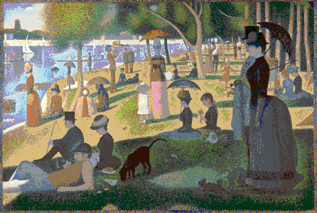
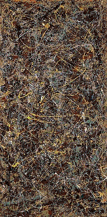

#LEGO® Enhanced Graphics Object (LEGO) File Format

A file format for representing 2D LEGO® brick images

_Note: LEGO® is a trademark of the LEGO Group of companies which does not sponsor, authorize or endorse this project._

##Specification

Read the [spec](SPEC.md).

##Installation

```bash
make && sudo make install
```

_Note: Dependencies include libpng and libjpeg._

##Usage

```bash
Usage: lego [--version,-v] [--help,-h]
			[--warranty,-w] [--conditions,-c]
			<command> [<args>]

The commands are:
   encode  Encodes a PNG into a LEGO file
   decode  Decodes a LEGO file into a PNG
   info    Prints the basic info about a LEGO file
   list    Tallies the number and types of bricks used
   colors  Lists all colors available
   bricks  Lists all bricks available
```

##Explanation

###Encoding

The encoding algorithm in the included program is very basic and converts images on a line by line basis. For example:


But with a human touch (or a better encoder) the result yields less bricks by thinking outside the single line:


###Decoding

When decoding, each new brick is placed in the top-most/left-most open space.

##Examples

Mona Lisa by Leonardo da Vinci (72,001 bricks):


A Sunday Afternoon on the Island of La Grande Jatte by Georges Seurat (65,268 bricks):



No. 5, 1948 by Jackson Pollock (79,974 bricks):

